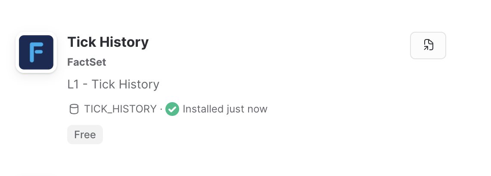
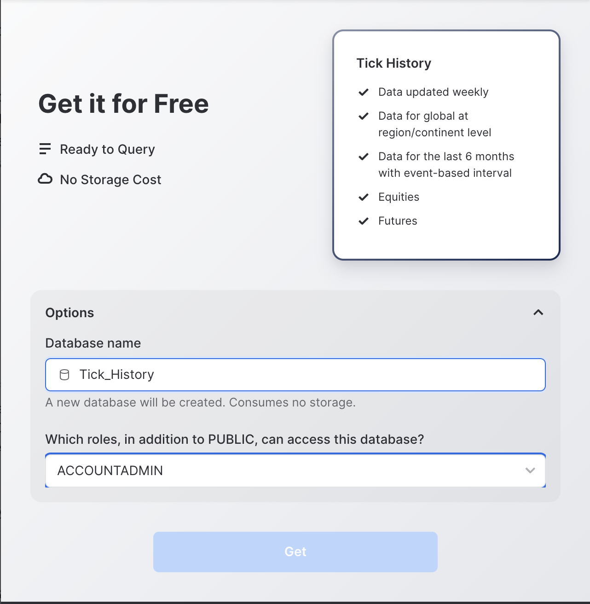
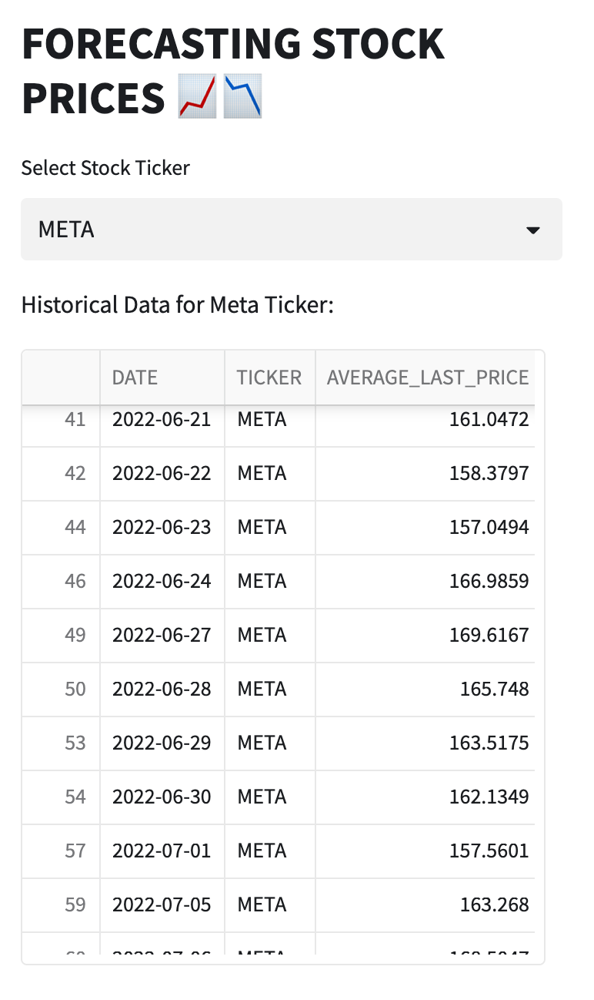
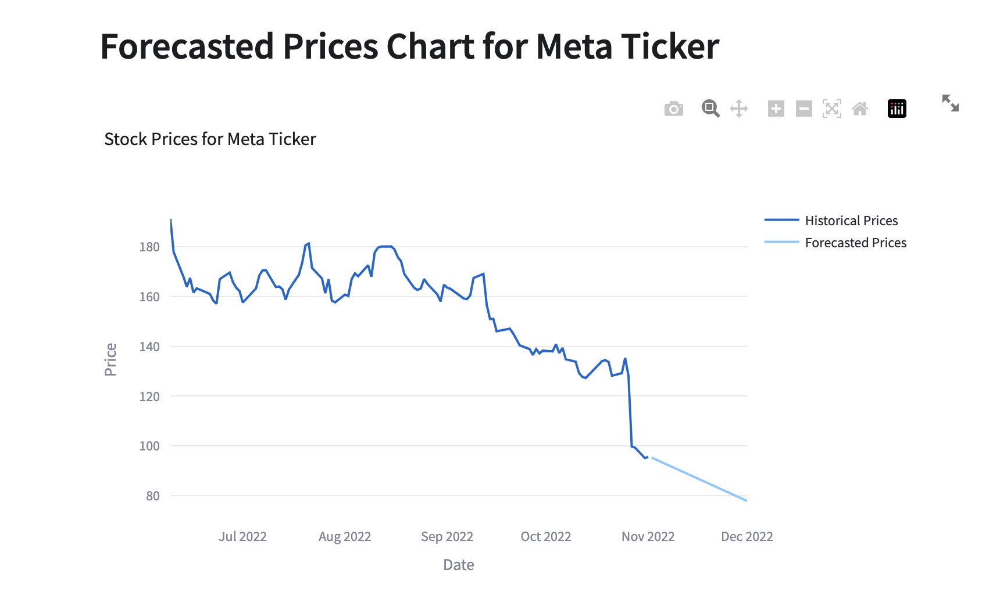
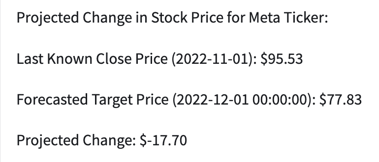
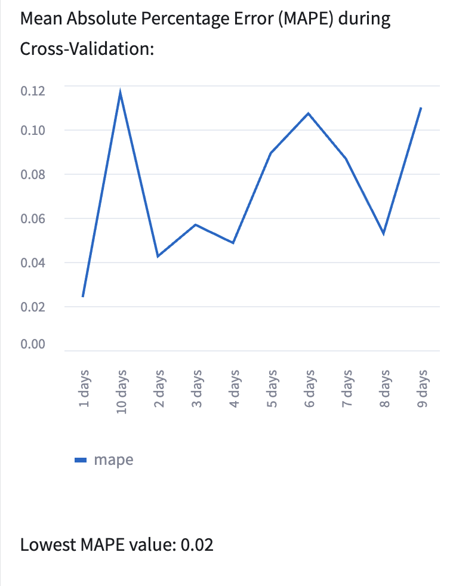
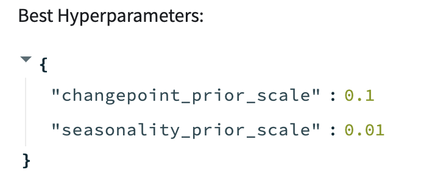

summary: Time Series Forecasting with Streamlit/Snowpark
id: Forecasting-price-streamlit-snowflake
categories: data-science-&-ml,partner-integrations
environments: web
status: Published
feedback link: https://github.com/Snowflake-Labs/devlabs/issues
tags: Getting Started, Data Science, Data Engineering, Modeling, Financial Services
authors: Streamlit

# Time Series Forecasting with Streamlit/Snowpark
<!-- ------------------------ -->
## Overview 
Duration: 30

In this guide, we'll be walking you through how to build a time series forecasting model using streamlits data science notebook with data loaded from Snowflake's Data Marketplace! We will be forecasting on stock market close values. _Please note:_ This walk through is not to be used for investing purposes. This is intended to be used as a guide to demonstrate an example of how to use Streamlit and Snowflake.

### Prerequisites
- Familiarity with Python
- Familiarity with SQL

### What You’ll Learn 
- How to use Snowflakes fully managed streamlit app
- How to clone data from the Data Marketplace in Snowflake
- How to access Python libraries in streamlit
- Introduction to [Statsmodel Library]([https://facebook.github.io/prophet/docs/quick_start.html#python-api](https://www.statsmodels.org/stable/index.html)) for time series forecasting
- Notebook style reporting with built in data visualizations
- How to write forecasted results from streamlit to Snowflake

### What You’ll Need 
- Snowflake Demo Account
- A cup of coffee and your brain 
- *There are no downloads required for this guide!!*

### What You’ll Build 
- A model to predict 30 days into the future of close values for the <details>
<summary>Stock Options</summary>

- IBM
- META

</details> 


<!-- ------------------------ -->
## Get US Stock Market data in Snowflake
Duration: 10

### Create a Snowflake Account:
[Sign up for free](https://signup.snowflake.com/)

### Clone data from Snowflake's Data Marketplace
1. Login to Snowflake > Open the Data Marketplace 
2. Search for the 'Tick History' Dataset 
 
3. Select 'Get Data'. This user must have `ACCOUNTADMIN` privileges
4. Assign a database name and roles for who should have access to this database
5. Select Create Get > Query Data to get started
   

> aside positive
> 
>  You must have `ACCOUNTADMIN` privileges to clone this data set

#### *Troubleshooting* 
Check if the database was created properly
```sql
Select * FROM "PUBLIC"."TH_SF_MKTPLACE"
where ticker='META' and date =20221025;
```

Check if privileges are set correctly:
This database needs to have `SELECT` privileges for a Role that your user has access to. Setting the `SELECT` privilege for the PUBLIC role will allow all users to read data from this database.
* View privilege: [Doc](https://docs.snowflake.com/en/sql-reference/sql/show-grants.html)
* Assign privileges: [Doc](https://docs.snowflake.com/en/sql-reference/sql/grant-privilege.html)

<!-- ------------------------ -->

### Create New Snowflake Database and Tables

1. Go on the left hand side, select Data -> Databases -> + Database. Name it STREAMLIT FORECAST STOCKS.
2. Now create a new worksheet. Go on the left hand side, click the worksheet tab, and click + worksheet in the top right corner, select SQL worksheet. Name it AVG Price/Selected Tickers.
3. Now let's use our created datebase.
   ```sql
   USE DATABASE STREAMLIT_FORECAST_STOCKS;
   USE SCHEMA PUBLIC;
   ```
4. Next, Create a new table 'selected_tickers' with the specific stock symbols used querying the 'tick_history' database from the marketplace.
   ```sql
   CREATE OR REPLACE TABLE selected_tickers AS
   SELECT DISTINCT ticker, date, last_price
   FROM tick_history.public.TH_SF_MKTPLACE
   WHERE ticker IN ('IBM','META')
    AND date BETWEEN '20220101' AND '20221230'
   ORDER BY date;
   ```
  Use a select query to view the table we just created.
  ```sql
  SELECT DISTINCT *
  FROM selected_tickers
  WHERE ticker IN ('IBM','META')
  order by date;
  ```
5. Now, create a new table that takes the average of the 'last_price' column that we will use in our forecasting model.
   ```sql
   CREATE OR REPLACE TABLE avg_last_price AS
   SELECT date,
          ticker,
          AVG(LAST_PRICE) AS average_last_price
   FROM selected_tickers
   WHERE date BETWEEN '20220101' AND '20221230'
   GROUP BY ticker, date
   ORDER BY date;
   ```
   Use a select query to view the table we just created.
   ```sql
   SELECT DISTINCT *
   FROM avg_last_price
   WHERE ticker IN ('META','IBM')
   order by date;
   ```
   Now let's move forward with the time series model.
### Creating New Streamlit App Directly in Snowflake
1. From the main screen in your demo account, Select Streamlit on the left hand side
2. Select _+ Streamlit App in the top right hand corner
3. Enter App Details:
 * rename "Forecasting Stock Prices"
 * choose created warehouse
 * choose database 'STREAMLIT_FORECAST_STOCKS' created earlier
</br>

### Understanding Streamlit Options
__Main Concepts:__ [Doc](https://docs.streamlit.io/library/get-started/main-concepts)

Streamlit's architecture allows you to write apps the same way you write plain Python scripts. The tight loop between coding and viewing results live is one of the ways Streamlit makes your life easier.

__Advanced Features:__ [Doc](https://docs.streamlit.io/library/advanced-features)

Sreamlit provides you with a configurable menu within your app, command line tool, theming options, caching, etc. as apart of advanced features offered. 

__Cheat Sheet:__ [Doc](https://docs.streamlit.io/library/cheatsheet)

Here is a cheat sheet of all relevant commands in streamlit to help build your app.
<!-- ------------------------ -->
## Install and Import Libraries
Duration: 5

### Overview
Streamlit provides a simple option for loading libraries. When in your newly created streamlit app you can simply click the packages selector, search the packages you want to use, and import them using simple commands.

### In the Streamlit app:
The packages that need to be downloaded include 'pandas', 'snowflake-snowpark-python', 'statsmodels', and 'prophet'. As stated before search these in the packages bar and click to download them.

Add this code to the top of your streamlit app to import these libraries:
```python
%python
import streamlit as st
import pandas as pd
from snowflake.snowpark.context import get_active_session
import statsmodels.api as sm
from prophet import Prophet
from prophet.diagnostics import cross_validation, performance_metrics
```

#### Code Explained
Now we have imported the libraries installed in the previous paragraph. You did not need to install streamlit as this comes preinstalled. Snowflake makes it easy to use in streamlit with a no hassle installation.

### Troubleshooting
* Double check to make sure all the required libraries were installed from the packages bar to avoid having any trouble with this.
<!-- ------------------------ -->
## Query Snowflake
Duration: 1
### Create Active session
To create an active session for snowflake using the get_active_session that we imported in streamlit simply run the following code.
```python
# Establish the Snowflake session
session = get_active_session()
```

#### Code Explained
This command establishes a snowflake session so you can interact with the snowflake data.
### Troubleshooting:
* Double check that the get_active_session import has no errors
* If it does try re-installing the 'snowflake-snowpark-python' package

<!-- ------------------------ -->
## Building a Time Series Forecast
Duration: 20

__TL;DR:__ Predicting the future based on past events requires the past to have patterns that may repeat in the future. Future stock market prices are influenced by many external sources, thus solely relying on past events to pick stocks is not the best strategy. In this walk through, we are going to ignore that guidance and do it anyway. This guide is not intended to influence your personal trading decisions.

### Overview

In this section we will explore the data for our selected stock tickers 'IBM' and 'META', build a time series forecast, and visualize the results. All of the code can be referenced here: [Notebook Code](https://app.zepl.com/viewer/notebooks/bm90ZTovL3pzaGFpbnNreUB6ZXBsLmNvbS8xZjNiMjQwZTFjZjQ0MDk4YTU0Njc1MDM3MTMwNThlZC9ub3RlLmpzb24/20210330-212709_1676214636). We will be using the statsmodel libray with Python for our analysis. 

We will be looking at stock prices for International Business Machine Corp(IBM) and META. Using the statsmodels model, we will look at all of the last price values for both these stocks and determine if we can make stock trend predictions with a remotely accurate result. 

### Retrieve Data for Specific Stock Tickers
First let's retrieve data from our avg_last_price table in Snowflake and create a new dataframe to store it. Add this code in your app:
```python
%python
#function to load the data
def load_data():
    #dataframe for our AVG_LAST_PRICE table
    historical_data = session.table("AVG_LAST_PRICE")

    #Run an SQL query to make sure we are using the specific stock ticker data
    historical_data = session.sql(f"SELECT DISTINCT * FROM avg_last_price WHERE ticker IN ('META','IBM') ORDER BY date;")

    #convert the data retrieved from the Snowflake database into a pandas DataFrame
    avg_price = historical_data.to_pandas()

    # Parse the date to 'YYYY-MM-DD' format
    avg_price['DATE'] = avg_price['DATE'].apply(parse_date)

    return avg_price
```
#### Code Explained
This creates us a dataframe to store our AVG_LAST_PRICE TABLE that we created earlier in snowflake and converts it using pandas.

### Function to Parse 'date' Column/Create Header
Now let's create a parsing function to parse the date into the correct 'YYYY-MM-DD' format for forecasting. Add this code in your app:
```python
%python
# Function to parse the integer date (YYMMDD) to 'YYYY-MM-DD' format
def parse_date(date_int):
    year = date_int // 10000
    month = (date_int // 100) % 100
    day = date_int % 100
    return f'{year:04d}-{month:02d}-{day:02d}'
```
#### Code Explained
`year = date_int // 10000:`<br> 
This line extracts the year from the date_int by performing integer division by 10000. 

`month = (date_int // 100) % 100:`<br> 
This line extracts the month from the date_int by first performing integer division by 100 to remove the last two digits representing the day. Then, the result is taken modulo 100 to keep the last two digits representing the month.

`day = date_int % 100`<br> 
This line extracts the day from the date_int by taking the modulo 100, which keeps only the last two digits representing the day. 

`return f'{year:04d}-{month:02d}-{day:02d}'`<br> 
This line uses f-string formatting to combine the extracted year, month, and day into a string in the format 'YYYY-MM-DD'. The format codes :04d and :02d ensure that the year is displayed with four digits, the month with two digits, and the day with two digits (adding leading zeros if necessary).

### Display Historical Data
Under the code above implement the following to create a header, dropdown menu, and chart to display the historical data for each stock ticker
```python
%python
#create header for streamlit app
st.title("FORECASTING STOCK PRICES 📈📉")

try:
    avg_price = load_data()

    # Create a dropdown menu to select the stock ticker
    ticker_mapping = {'META': 'Meta Ticker', 'IBM': 'IBM Ticker'}
    selected_ticker = st.selectbox("Select Stock Ticker", list(ticker_mapping.keys()))

    # Filter data based on the selected stock ticker
    df_selected_ticker = avg_price[avg_price["TICKER"] == selected_ticker]

    # Display historical data for the selected stock ticker in a table format
    st.write(f"Historical Data for {ticker_mapping[selected_ticker]}:")
    st.dataframe(df_selected_ticker)
```

#### Code Explained
`ticker_mapping = {'META': 'Meta Ticker', 'IBM': 'IBM Ticker'}`<br> 
This line creates a dictionary ticker_mapping that maps the ticker symbols ('META' and 'IBM') to their corresponding human-readable names ('Meta Ticker' and 'IBM Ticker'). 

`selected_ticker = st.selectbox("Select Stock Ticker", list(ticker_mapping.keys()))`<br> 
This line creates a dropdown menu using the Streamlit function st.selectbox(). 

`df_selected_ticker = avg_price[avg_price["TICKER"] == selected_ticker]`<br> 
This line filters the DataFrame avg_price to retrieve data for the selected stock ticker. It selects rows where the value in the "TICKER" column matches the selected_ticker, creating a new DataFrame named df_selected_ticker. 

`st.write(f"Historical Data for {ticker_mapping[selected_ticker]}:")`<br> 
This line displays a title for the historical data table using the st.write() function. It includes the name of the selected stock ticker obtained from the ticker_mapping dictionary.

### Forecast Prices
Under the code above implement the following to create a header, dropdown menu, and chart to display the historical data for each stock ticker
```python
%python
# Prepare data for forecasting
df_selected_ticker.set_index('DATE', inplace=True)
y = df_selected_ticker['AVERAGE_LAST_PRICE']

# Fit ARIMA model
model = sm.tsa.ARIMA(y, order=(2, 1, 2))
results = model.fit()

# Make predictions for the next 30 days
period = 30
last_date = df_selected_ticker.index[-1]
future_dates = pd.date_range(start=pd.to_datetime(last_date) + pd.Timedelta(days=1), periods=period, freq='D')
forecast = results.forecast(steps=period)
```



#### Code Explained
`df_selected_ticker.set_index('DATE', inplace=True)`<br> 
This line sets the 'DATE' column as the index of the DataFrame df_selected_ticker. By setting the index, the DataFrame is organized based on dates, making it easier to work with time series data.

`y = df_selected_ticker['AVERAGE_LAST_PRICE']`<br> 
This line extracts the 'AVERAGE_LAST_PRICE' column from the DataFrame df_selected_ticker and assigns it to a new Series called y.

`model = sm.tsa.ARIMA(y, order=(2, 1, 2))`<br> 
This line creates an instance of the ARIMA (AutoRegressive Integrated Moving Average) model using the statsmodels library. ARIMA is a popular time series forecasting model that combines autoregression, differencing, and moving average components. 

`results = model.fit()`<br> 
This line fits the ARIMA model to the target variable y using the fit() method.

`period = 30`<br> 
This line sets the variable period to 30. It specifies the number of days for which we want to make future predictions.

`last_date = df_selected_ticker.index[-1]`<br> 
This line retrieves the last date in the index of the DataFrame df_selected_ticker. 

`future_dates = pd.date_range(start=pd.to_datetime(last_date) + pd.Timedelta(days=1), periods=period, freq='D')`<br> 
This line generates a sequence of future dates starting from the day after the last historical date. It uses the pd.date_range() function from pandas to create a range of dates. 

`forecast = results.forecast(steps=period)` 
This line makes predictions for the next 30 days (specified by the period variable) using the fitted ARIMA model (results).

### Visualize Predictions
The code below will generate a chart to display our trend in relation to actual stock close values. The dark blue lines represent the close values from our original dataset and the light blue line represents the trend determined by our model predictions .

```python
%python
# Display the forecasted prices
st.write(f"Forecasted Prices for the next {period} days for {ticker_mapping[selected_ticker]}:")
forecast_df = pd.DataFrame({'Date': future_dates, 'Forecasted Prices': forecast})
st.dataframe(forecast_df)

 # Display the forecasted prices using Plotly line chart
    st.write(f"## Forecasted Prices Chart for {ticker_mapping[selected_ticker]}")
    forecast_fig = go.Figure()
    forecast_fig.add_trace(go.Scatter(x=df_selected_ticker.index, y=df_selected_ticker['AVERAGE_LAST_PRICE'], mode='lines', name='Historical Prices'))
    forecast_fig.add_trace(go.Scatter(x=forecast_df['Date'], y=forecast_df['Forecasted Prices'], mode='lines', name='Forecasted Prices'))
    forecast_fig.update_layout(title=f"Stock Prices for {ticker_mapping[selected_ticker]}", xaxis_title='Date', yaxis_title='Price')
    st.plotly_chart(forecast_fig)
```



#### Code Explained
`st.write(f"Forecasted Prices for the next {period} days for {ticker_mapping[selected_ticker]}:")`<br> 
This line uses the st.write() function from Streamlit to display a text message that provides information about the forecasted prices. It includes the selected stock ticker and the number of days for which the forecast is made (period).

`forecast_df = pd.DataFrame({'Date': future_dates, 'Forecasted Prices': forecast})`<br> 
This line creates a new DataFrame called forecast_df. It is constructed using the forecasted values (forecast) and the corresponding future dates (future_dates). The DataFrame will have two columns: 'Date' and 'Forecasted Prices'.

`st.dataframe(forecast_df)`<br>
This line uses the st.dataframe() function from Streamlit to display the DataFrame forecast_df in a tabular format on the Streamlit app. This table will show the dates and the corresponding forecasted prices for the selected stock ticker.

`st.write(f"Plot of Average Price with Forecasted prices")`<br> 
This line displays a text message using st.write() to inform the user that the following chart is a plot of the average price along with the forecasted prices.

`st.line_chart(pd.concat([df_selected_ticker['AVERAGE_LAST_PRICE'], forecast_df.set_index('Date')], axis=1))`<br> 
This line uses the st.line_chart() function from Streamlit to display a line chart on the app. I
### Target Stock Price
The code below will display the change in stock price between our forecast value and our last known stock value. 

```python
%python
# Get the last known price and date from our stock dataset
num_rows_stock = df_selected_ticker.shape[0]
last_close_date = df_selected_ticker.index[-1]
last_close_value = df_selected_ticker['AVERAGE_LAST_PRICE'].iloc[-1]

# Get the prediction value and date from our forecasted trend
num_rows_forecast = forecast_df.shape[0]
last_forecast_date = forecast_df['Date'].iloc[-1]
last_forecast_value = forecast_df['Forecasted Prices'].iloc[-1]

# Display the projected change using Streamlit components
st.write(f"Projected Change in Stock Price for {ticker_mapping[selected_ticker]}:")
st.write(f"Last Known Close Price ({last_close_date}): ${last_close_value:.2f}")
st.write(f"Forecasted Target Price ({last_forecast_date}): ${last_forecast_value:.2f}")
st.write(f"Projected Change: ${last_forecast_value - last_close_value:.2f}")
```



#### Code Explained
`num_rows_stock = df_selected_ticker.shape[0]`<br> 
This line calculates the number of rows in the DataFrame df_selected_ticker, which represents the historical data for the selected stock ticker. 

`last_close_date = df_selected_ticker.index[-1]`<br> 
This line extracts the last date in the index of the DataFrame df_selected_ticker. 

`last_close_value = df_selected_ticker['AVERAGE_LAST_PRICE'].iloc[-1]`<br> 
This line extracts the last value from the 'AVERAGE_LAST_PRICE' column of the DataFrame df_selected_ticker. 

`num_rows_forecast = forecast_df.shape[0]`<br> 
This line calculates the number of rows in the DataFrame forecast_df, which contains the forecasted prices for the selected stock ticker. 

`last_forecast_date = forecast_df['Date'].iloc[-1]`<br> 
This line extracts the last date from the 'Date' column of the DataFrame forecast_df. This date represents the last date for which the forecasted price is available, which corresponds to the end of the forecasted period.

`last_forecast_value = forecast_df['Forecasted Prices'].iloc[-1]`<br> 
This line extracts the last value from the 'Forecasted Prices' column of the DataFrame forecast_df. This value represents the forecasted stock price for the last date in the forecasted period.

`st.write(f"Projected Change in Stock Price for {ticker_mapping[selected_ticker]}:")`<br> 
This line displays a text message using st.write() to indicate that the following information is related to the projected change in the stock price for the selected stock ticker.

`st.write(f"Last Known Close Price ({last_close_date}): ${last_close_value:.2f}")`<br>
`st.write(f"Forecasted Target Price ({last_forecast_date}): ${last_forecast_value:.2f}")`<br> 
This line displays the last known closing price and the forecasted target price of the stocks along with the corresponding date.

`st.write(f"Projected Change: ${last_forecast_value - last_close_value:.2f}")`<br> 
This line calculates and displays the projected change in the stock price by subtracting the last known closing price from the forecasted target price. 
<!-- ------------------------ -->
## Validate Our Predictions 
Duration: 5

### Overview
Now that we have created a prediction, we should validate the confidence level in our results. We will use cross-validation to make a series of predictions for a given a time window (horizon) and compare the predicted value to the actual value. In our case, we will compare predicted prices for actual prices. We are switching to the prophet library in order to do this. 

### Cross-Validation
```python
%python
# Cross-validation
m = Prophet()
df_selected_ticker.reset_index(inplace=True)
df_selected_ticker = df_selected_ticker.rename(columns={'DATE': 'ds', 'AVERAGE_LAST_PRICE': 'y'})
m.fit(df_selected_ticker)
df_cv = cross_validation(m, initial='30 days', period='20 days', horizon='10 days', parallel="processes")

# Performance metrics
df_p = performance_metrics(df_cv)

# Sort the DataFrame by 'horizon' column in chronological order
df_p = df_p.sort_values(by='horizon')
```
### Code Explained
`m = Prophet()`<br> 
Create a new instance of the Prophet class, which represents the forecasting model provided by the Prophet library.

`df_selected_ticker.reset_index(inplace=True)`<br> 
Reset the index of the DataFrame df_selected_ticker, which was previously set to the 'DATE' column. By resetting the index, we convert the 'DATE' column back to a regular column, and a new default numeric index will be generated.

`df_selected_ticker = df_selected_ticker.rename(columns={'DATE': 'ds', 'AVERAGE_LAST_PRICE': 'y'})`<br> 
Rename the columns of the DataFrame df_selected_ticker to match the required format for Prophet. The 'DATE' column is renamed to 'ds', which represents the time series data (i.e., the date or time). The 'AVERAGE_LAST_PRICE' column is renamed to 'y', which represents the target variable we want to forecast (i.e., the stock price).

`m.fit(df_selected_ticker)`<br> 
Fit the Prophet model to the historical data in df_selected_ticker. This step involves learning the model parameters based on the historical trends and patterns in the stock price.

`df_cv = cross_validation(m, initial='30 days', period='20 days', horizon='10 days', parallel="processes")`<br>
Perform cross-validation on the fitted Prophet model. Cross-validation is a technique used to assess how well the model performs on unseen data. In this case, we split the historical data into multiple overlapping time periods, where each period has a training set ('initial' days), a testing set ('horizon' days), and an evaluation period ('period' days). The parameter 'parallel="processes"' indicates that we want to perform cross-validation using multiple parallel processes for efficiency.

`df_p = performance_metrics(df_cv)`<br> 
Calculate performance metrics based on the cross-validation results. The df_cv DataFrame contains the forecasted values along with the actual values for the testing sets. The performance_metrics() function computes various evaluation metrics, such as Mean Absolute Percentage Error (MAPE), Mean Squared Error (MSE), Root Mean Squared Error (RMSE), etc.

`df_p = df_p.sort_values(by='horizon')`<br> 
Sort the DataFrame df_p by the 'horizon' column in chronological order. 
### Cross-Validation Results
```python
# Display MAPE values during cross-validation
st.write("Mean Absolute Percentage Error (MAPE) during Cross-Validation:")
st.line_chart(df_p.set_index('horizon')['mape'])

# Get lowest MAPE value
lowest_mape = df_p['mape'].min()
st.write(f"Lowest MAPE value: {lowest_mape:.2f}")
```



### Code Explained
`st.write("Mean Absolute Percentage Error (MAPE) during Cross-Validation:")`<br> 
Use Streamlit's st.write() function to display a heading that indicates what the following chart represents, which is the MAPE values during cross-validation.

`st.line_chart(df_p.set_index('horizon')['mape'])`<br> 
Use Streamlit's st.line_chart() function to create a line chart. The chart is based on the DataFrame df_p, which contains the performance metrics from the cross-validation process.

`lowest_mape = df_p['mape'].min()`<br> 
Use Pandas' min() function to find the lowest MAPE value from the 'mape' column of the DataFrame df_p. 

`st.write(f"Lowest MAPE value: {lowest_mape:.2f}")`<br> 
Use Streamlit's st.write() function to display the lowest MAPE value with two decimal places. This value represents the best MAPE achieved during the cross-validation, indicating the model's overall accuracy in forecasting the stock prices. A lower MAPE value indicates better accuracy, as it means the forecasts were closer to the actual values.
<!-- ------------------------ -->
## Next Steps: Improving our model with Hyperparameter Tuning
Duration: 5

### Overview
In order to improve the accuracy of our forecasted predations, we will test out many different values for how sensitive the model is to changepoints and seasonality. Hyperparameter tuning is a fancy name for a very simple concept. In order to tun our model we will test out lots of different parameters and compare the accuracy of the results. The parameters that produce the most accurate prediction values (MAPE or other error values) is the winner. We will perform the same cross-validation as we have in the previous 2 steps, only this time, we will use different values for `changepoint_prior_scale` and different values for `seasonality_prior_scale`.

### Implement Hyperparameter Tuning and Display Results
```python
%python
# Hyperparameter tuning
changepoint_grid = [0.001, 0.01, 0.1, 0.5]
seasonality_grid = [0.01, 0.1, 1.0, 10.0]
period = '30 days'
horizon = '10 days'
    
best_mape = float('inf')
best_params = {}

for changepoint_prior_scale in changepoint_grid:
        for seasonality_prior_scale in seasonality_grid:
            m = Prophet(changepoint_prior_scale=changepoint_prior_scale, seasonality_prior_scale=seasonality_prior_scale)
            m.fit(df_selected_ticker)
            df_cv = cross_validation(m, initial=period, period=period, horizon=horizon)
            df_p = performance_metrics(df_cv)
            avg_mape = df_p['mape'].mean()
            
            if avg_mape < best_mape:
                best_mape = avg_mape
                best_params['changepoint_prior_scale'] = changepoint_prior_scale
                best_params['seasonality_prior_scale'] = seasonality_prior_scale

st.write(f"Best Hyperparameters:")
st.write(best_params)
```



### Code Explained
`changepoint_grid = [0.001, 0.01, 0.1, 0.5]`<br> 
This line defines a list called changepoint_grid containing different values for the changepoint_prior_scale hyperparameter. It sets up a grid of potential values to be tested during hyperparameter tuning.

`seasonality_grid = [0.01, 0.1, 1.0, 10.0]`<br>
This line defines a list called seasonality_grid containing different values for the seasonality_prior_scale hyperparameter. Similar to changepoint_grid, it sets up a grid of potential values for hyperparameter tuning.

`period = '30 days'`<br> 
This line defines the length of the initial training period for the cross-validation process. It is set to '30 days', indicating that the initial training period for each fold of cross-validation will be 30 days.

`horizon = '10 days'`<br> 
This line defines the forecast horizon for the cross-validation process. It is set to '10 days', meaning that the model will forecast the stock prices for the next 10 days during each fold of cross-validation.

`best_mape = float('inf')`<br> 
This line initializes the variable best_mape with a value of positive infinity. This is done so that any MAPE value obtained during hyperparameter tuning will be considered better than the initial value.

`best_params = {}`<br> 
This line initializes an empty dictionary called best_params, which will store the best set of hyperparameters found during the hyperparameter tuning process.

`for changepoint_prior_scale in changepoint_grid`<br> 
This line starts a loop that iterates through each value in the changepoint_grid. It allows us to try out different values for the changepoint_prior_scale hyperparameter during hyperparameter tuning.

`for seasonality_prior_scale in seasonality_grid`<br> 
This line starts a nested loop that iterates through each value in the seasonality_grid. It allows us to try out different values for the seasonality_prior_scale hyperparameter while keeping the changepoint_prior_scale fixed.

Inside the nested loops, we create a new instance of the Prophet model named m with the specific combination of changepoint_prior_scale and seasonality_prior_scale.fit the m model to the training data df_selected_ticker. Perform cross-validation for the trained model m. The cross_validation function generates forecasts for each cutoff point in the time series, where the forecast horizon is defined by the horizon parameter, and the initial training period is defined by the initial parameter. The cross-validation results are stored in the DataFrame df_cv.Calculate performance metrics based on the cross-validation results stored in df_cv. The performance_metrics function computes various evaluation metrics, including MAPE (Mean Absolute Percentage Error), among others. Calculate the average MAPE (avg_mape) across all forecast horizons from the cross-validation results.Check if the calculated avg_mape is lower (indicating better performance) than the current best_mape. If it is, the condition evaluates to True, and the following code block will be executed. If avg_mape is lower than the current best_mape, we update the variable best_mape to the new lower value of avg_mape. It keeps track of the lowest MAPE achieved so far during the hyperparameter tuning process. Update the best_params dictionary with the values of changepoint_prior_scale and seasonality_prior_scale that resulted in the lowest MAPE. The best_params dictionary will store the best set of hyperparameters that yield the most accurate forecasts. After the loops, we will have the best hyperparameters stored in best_params for further use.
```

<!-- ------------------------ -->
## References and Notes
Duration: 0

### References:
*Original Zepl Reference Quickstart
[Original quickstart](https://quickstarts.snowflake.com/guide/time_series_forecasting_zepl/index.html?index=..%2F..index#7)
* Blogs
 * [towards data science](https://towardsdatascience.com/time-series-analysis-with-statsmodels-12309890539a)
 * [Statsmodel library](https://www.statsmodels.org/stable/index.html)
* Considerations for why Stock Forecasting is very hard: "Statsmodel is able to detect and fit these, but what trend changes should we expect moving forward? It’s impossible to know for sure, so we do the most reasonable thing we can, and we assume that the future will see similar trend changes as the history." [Ref]((https://towardsdatascience.com/8-reasons-why-forecasting-is-hard-481755a05325))
* Cross Validation 
 * [fbprophet documentation](https://facebook.github.io/prophet/docs/diagnostics.html#cross-validation)
 * How to use multi-processing: "For problems that aren’t too big, we recommend using `parallel="processes"`. It will achieve the highest performance when the parallel cross validation can be done on a single machine." [Ref](https://facebook.github.io/prophet/docs/diagnostics.html#:~:text=For%20problems%20that%20aren't,cross%20validation%20on%20many%20machines.)
* How Prophet determines change points: Changepoints are the datetime points where the time series have abrupt changes in the trajectory.
By default, Prophet adds 25 changepoints to the initial 80% of the data-set.
Let’s plot the vertical lines where the potential changepoints occurred" [Ref](https://towardsdatascience.com/time-series-prediction-using-prophet-in-python-35d65f626236)
* Error Metrics: [Ref](https://stochasticcoder.com/2016/04/25/forecasting-and-python-part-1-moving-averages/)
